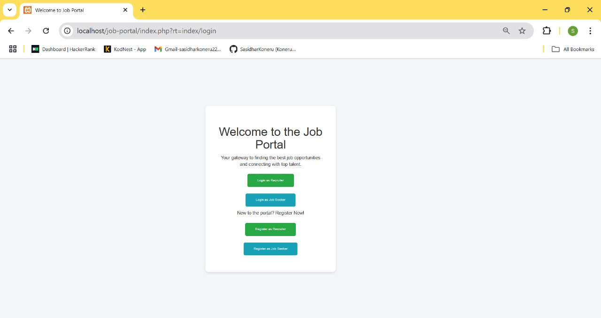
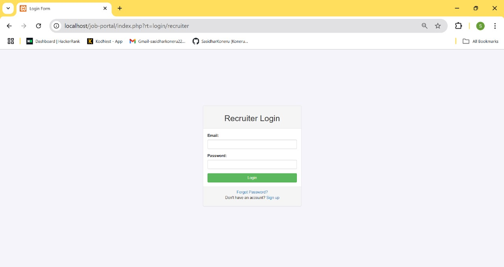
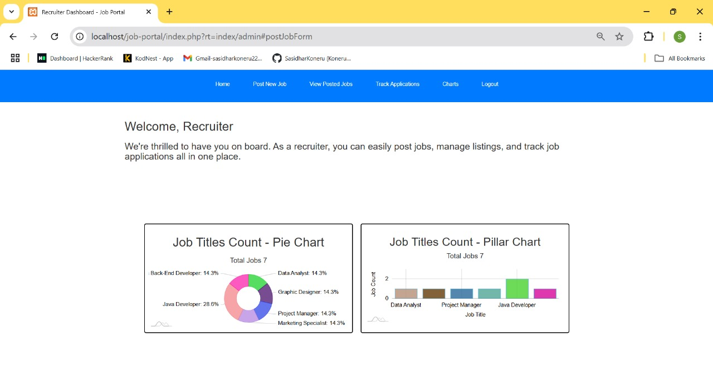
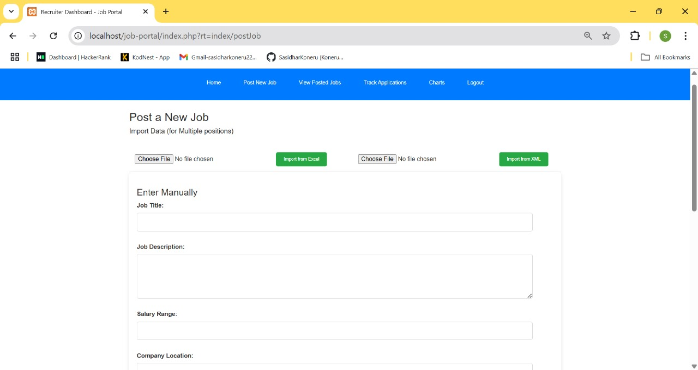
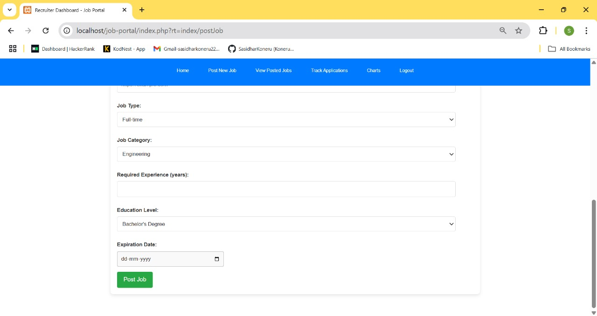
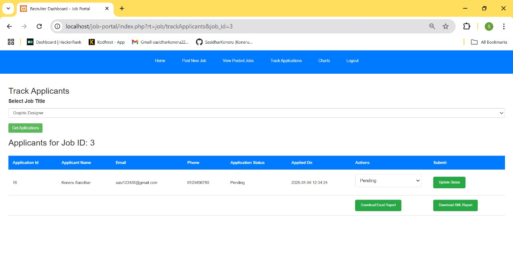
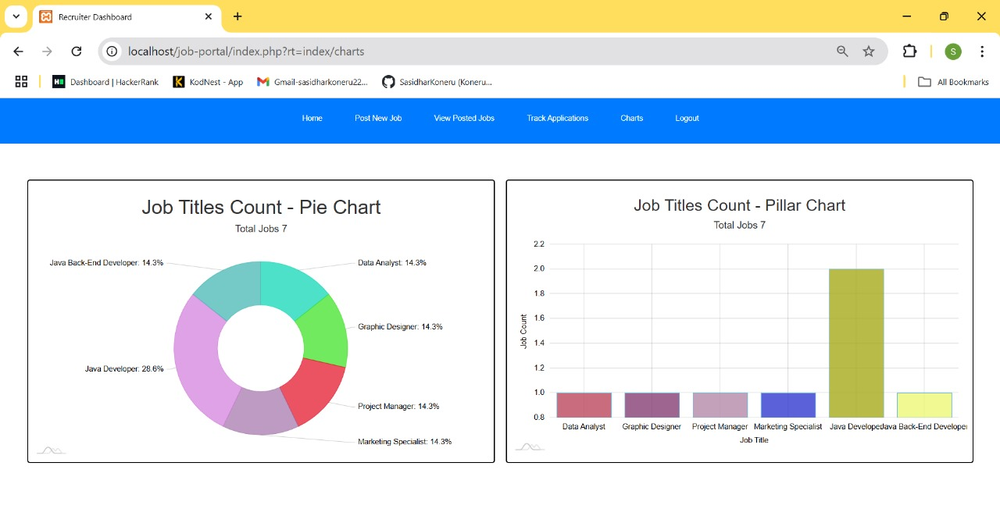
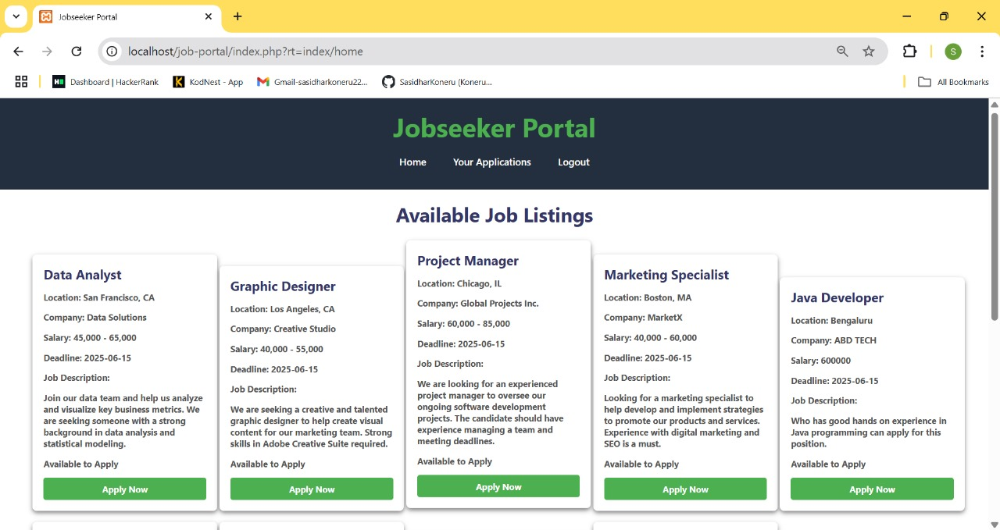
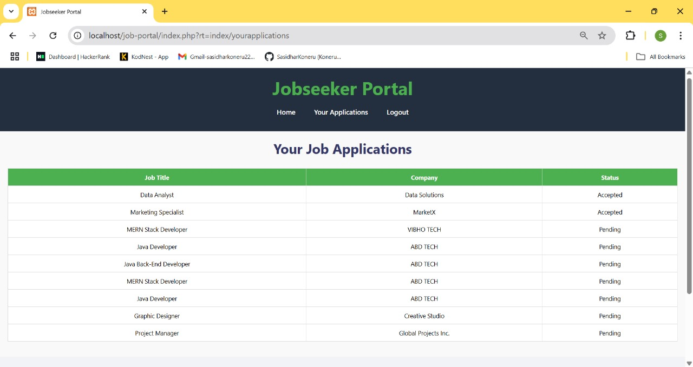

# 💼 FoundIn – Smart Job Portal

**FoundIn** is a dynamic, PHP-based job portal application that connects job seekers with employers through a secure, interactive, and database-driven web platform. It offers powerful features for managing user accounts, job postings, and applications — all built for flexibility and speed.

---

## 🌐 Key Features

🔹 **User Registration & Authentication**  
Secure login and sign-up forms for job seekers and employers, with session management.

🔹 **Job Posting & Search**  
Employers can post job openings, and candidates can search or filter based on roles, location, or skills.

🔹 **Application Management**  
Job seekers can apply to jobs, view application history, and receive status updates.

🔹 **Admin Controls**  
Administrative dashboard for monitoring users, jobs, and platform activity.

🔹 **Responsive UI**  
Clean, mobile-friendly interface using modern frontend practices.

🔹 **Database Integration**  
Supports MySQL, PostgreSQL, or any supported RDBMS for persistent data management.

🔹 **Security First**  
Built-in mechanisms to prevent common threats like SQL injection and session hijacking.

---

## 🚀 Getting Started

### ⚙️ Requirements

- PHP (v7.4 or later recommended)  
- MySQL or PostgreSQL  
- Apache/Nginx server (XAMPP, WAMP, or LAMP stack)

### 🛠️ Setup Instructions

1. **Clone the repository**
   ```bash
   git clone https://github.com/your-username/foundin.git

--- 
## 📸 Screenshots

### 🏠 Welcome Page


### 🔐 Login Pages
**Recruiter Login**



**Job Seeker Login**


### 📊 Dashboards
**Recruiter**
- Home


- Job Posting





- Veiw Posted Jobs


- Track Applications



- Charts




**Job Seeker**
- Dashboard



- Track Applications




